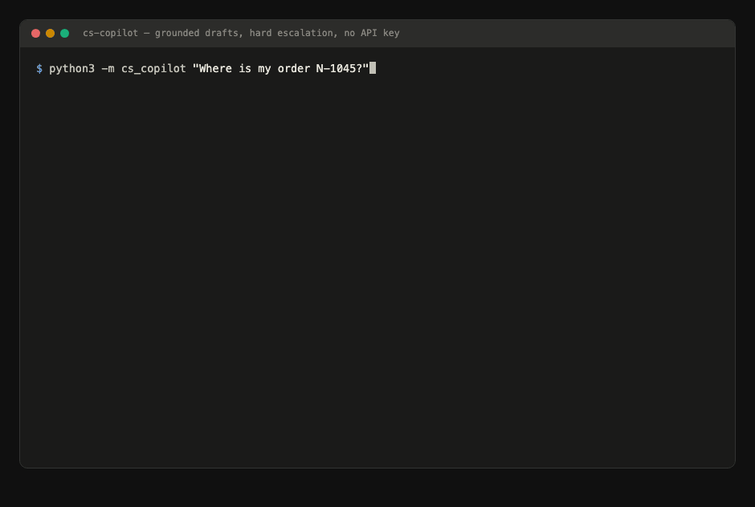

# AI Transformation in 90 Days

**A transformation copilot for the first 90 days of an AI program — a complete method (playbook, opportunity portfolio, costed business cases, operating model) plus the software to run it: an MCP assistant with evidence-gated scoring, working prototypes, and a weekly autopilot.**

The outcome after 90 days: **the right opportunities identified from evidence, pilots shipped and measured against frozen baselines, and an operating model that scales beyond the central AI team.**

> ⚠️ The two case companies, their people and numbers are fictional. The method, the artifacts and the code are real and reusable — swap the fictional org for yours ([`org.yaml`](cases/nordwerk/org.yaml)) and the copilot runs your program. Built in the open by [Benjamin Zengler](https://github.com/benmfzen).

📊 **[Interactive dashboard](https://benmfzen.github.io/ai-transformation-90/)** (impact matrix, scoring heatmap, 90-day timeline) · 📝 [Changelog](CHANGELOG.md)

## What's inside — five capabilities, five minutes

| The question | Where the answer is |
|---|---|
| **Strategy** — how do the first 90 days get structured? | [90-day playbook](playbook/00-programmueberblick.md): 3 phases, decision points at day 30/60/90, abort criteria — no months-long strategy phase |
| **Commercial judgment** — how are opportunities prioritized? | [AI Opportunity Portfolio](cases/natura-foods/portfolio.md) (12 initiatives, efficiency/opportunity split) + [3 costed business cases](cases/natura-foods/README.md#whats-in-this-case) with baselines, payback and honest confidence levels |
| **Transformation** — how do team leads keep ownership? | [Operating model](cases/natura-foods/operating-model.md) (2 central FTE, 10 team leads owning outcomes, RACI, rhythms) + [team lead coaching](cases/natura-foods/team-lead-coaching.md) — from "we want more AI" to a shipped, measured outcome |
| **Working software** — does any of this actually run? | [CS Copilot prototype](prototypes/cs-copilot/): runnable code, grounded answers with citations, hard escalation rules, **eval harness gating CI** — clone and run it, no API key needed |
| **The copilot** — can the method itself run as software? | Paste an interview transcript and the [assistant](mcp-server/) extracts evidence, proposes scores, **rejects unsupported claims** and updates the portfolio — the method as an installable toolset (MCP). And [every Monday](prototypes/wbr-autopilot/) a scheduled agent drafts the weekly business review as a PR, every figure recomputed before it ships |

## Guided tour — pick your depth

| You have… | Read/do this |
|---|---|
| **5 minutes** | [README](#five-proof-pieces-five-minutes) → [dashboard](https://benmfzen.github.io/ai-transformation-90/) → one [business case](cases/natura-foods/business-cases/cs-copilot.md) |
| **15 minutes** | \+ run the [CS Copilot](prototypes/cs-copilot/) (`pytest` + eval gates + one query, no API key) → read a [Monday autopilot PR](https://github.com/benmfzen/ai-transformation-90/pulls?q=is%3Apr+wbr) → skim the [method summary (EN)](METHOD.md) |
| **45 minutes** | \+ connect the [MCP server](mcp-server/) and debrief a transcript → [operating model](cases/natura-foods/operating-model.md) → [portfolio](cases/natura-foods/portfolio.md) → [playbook](playbook/00-programmueberblick.md) (DE) |

## The core beliefs this repo encodes

1. **Read the organization before picking use cases.** Every department/team gets profiled and scored — impact (is it worth it?) × readiness (can it work now?). The pilot order is derived, not negotiated politically. → [Scoring model](methodik/champion-scoring.md)
2. **Champions before use cases.** The best use case under an unwilling lead loses to a decent one under a motivated lead. Momentum is the scarcest resource. → [How champions are recognized, not appointed](methodik/champion-scoring.md#vom-score-zum-champion)
3. **Time to evidence beats theoretical value.** The highest-value initiative in the portfolio is deliberately *not* pilot #1 — it gets a data project first. Early proof buys the trust that everything later needs. → [The trade-off, made explicit](cases/natura-foods/portfolio.md#why-these-three-pilots)
4. **Measure or stop.** Every pilot has a frozen baseline, a target metric and an abort criterion before it starts. Time saved is not value realized — the cases document what happens with the freed capacity. → [Pilot charter](templates/pilot-charter.md) · [Business cases](cases/natura-foods/business-cases/cs-copilot.md)
5. **Guardrails over bans, in code where possible.** Governance legalizes shadow AI instead of driving it underground; the prototype's red lines (health/legal escalation) are deterministic code that CI enforces, not prompt hopes. → [AI policy](governance/ai-richtlinie.md) · [ADR-002](decisions/adr-002-prototype-offline-first.md)

## Two cases, one method

| | [NATURA Foods SE](cases/natura-foods/README.md) 🇬🇧 | [NORDWERK GmbH](cases/nordwerk/nordwerk.md) 🇩🇪 |
|---|---|---|
| Business | Omnichannel food (D2C + retail), ~350 people | Industrial machinery SME, 520 people |
| Focus | Commercial portfolio, business cases, operating model, buy/build/deprecate, **prototype** | Org scan, champion scoring, change management (works council, shop-floor skepticism), dashboard |
| Why it exists | A consumer/e-commerce program environment | Where the method was first played through end-to-end |

Same method underneath ([playbook](playbook/), [scoring](methodik/champion-scoring.md), [templates](templates/)) — two very different organizations, which is the point ([ADR-001](decisions/adr-001-two-case-tracks.md)).

## Repository map

```
playbook/       the 90-day plan: 3 phases, to-dos, deliverables, abort criteria (DE)
methodik/       champion scoring model — the objective prioritization method (DE)
cases/
  natura-foods/ EN track: portfolio, 3 business cases, operating model,
                team-lead coaching, buy/build/deprecate
  nordwerk/     DE track: 9 department profiles, impact matrix
prototypes/
  cs-copilot/   working code: grounded CS drafts, escalation rules, eval gates
  wbr-autopilot/ scheduled agent: Monday cron drafts the weekly business review
                as a PR — anomalies ranked by EUR, every number re-verified
mcp-server/     the method as MCP tools: evidence-gated scoring, portfolio,
                decision memos, governance checks (core logic CI-tested)
tools/          generate.py — org.yaml (single source of truth) → dashboard + docs
templates/      9 fill-in artifacts (DE): interview guide, use-case canvas, pilot
                charter, status report, kick-off agenda, day-30/60/90 decision
                memo, training curriculum, tool clearance checklist, KPI sheet
governance/     AI policy — guardrails, EU AI Act red lines (DE)
decisions/      architecture decision records
docs/           interactive dashboard (GitHub Pages)
```

## Try the prototype (30 seconds, no dependencies)



```bash
git clone https://github.com/benmfzen/ai-transformation-90 && cd ai-transformation-90
python3 -m pytest prototypes/cs-copilot/tests/ -q      # 9 tests
python3 prototypes/cs-copilot/eval/run_eval.py          # eval gates: PASS
cd prototypes/cs-copilot && python3 -m cs_copilot "Where is my order N-1045?"
```

---

*German-language artifacts (playbook, NORDWERK case, templates, governance) are original working documents; the NATURA track and everything code is English. Questions → [github.com/benmfzen](https://github.com/benmfzen).*
