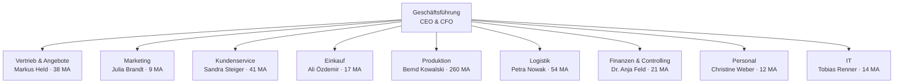

# NORDWERK GmbH — Firmenprofil (fiktiv)

> Frei erfundener Case für dieses Showcase-Programm. Jede Ähnlichkeit mit echten Unternehmen ist zufällig.

## Kerndaten

| | |
|---|---|
| Branche | Maschinenbau — Verpackungsanlagen & Service |
| Sitz | Norddeutschland, 2 Werke |
| Mitarbeitende | 520 |
| Umsatz | 88 Mio. € (davon 22 % Service/Ersatzteile) |
| Führung | Inhabergeführt, 2. Generation; CEO + CFO |
| IT-Landschaft | ERP (proAlpha), CRM (halbherzig gepflegt), M365, Ticketsystem im Service, Produktions-Daten teils auf Papier |
| KI-Status quo | Keine Strategie. Schatten-Nutzung: Vertrieb (ChatGPT für Angebotstexte), Marketing (Bildgenerierung). GF-Auftrag: „Wir müssen was mit KI machen — aber richtig." |

## Org-Chart

## Die 9 Abteilungen mit Scoring-Ergebnis

Vollprofile mit Kerndaten, Head-Einschätzung und Score-Begründung liegen in [`abteilungen/`](abteilungen/). Übersicht (Skala 1–5, Herleitung im [Scoring-Modell](../methodik/champion-scoring.md)):

| Abteilung | Head | MA | Impact | Readiness | Rolle im Programm |
|---|---|---|---|---|---|
| [Kundenservice](abteilungen/kundenservice.md) | Sandra Steiger | 41 | **4,7** | **4,3** | 🏆 Pilot P1 — Champion |
| [Vertrieb & Angebote](abteilungen/vertrieb.md) | Markus Held | 38 | **4,3** | 3,7 | Pilot P2 — Champion |
| [Finanzen & Controlling](abteilungen/finanzen.md) | Dr. Anja Feld | 21 | 3,7 | **4,0** | Pilot P3 |
| [Einkauf](abteilungen/einkauf.md) | Ali Özdemir | 17 | 3,3 | 3,3 | Welle 2 (Q1) |
| [Marketing](abteilungen/marketing.md) | Julia Brandt | 9 | 2,7 | **4,3** | Welle 2 — Quick Wins |
| [Logistik](abteilungen/logistik.md) | Petra Nowak | 54 | 3,3 | 2,7 | Welle 2 (Q1/Q2) |
| [Produktion](abteilungen/produktion.md) | Bernd Kowalski | 260 | **4,0** | 1,7 | Vorprojekt Datenqualität, dann Q3 |
| [Personal](abteilungen/personal.md) | Christine Weber | 12 | 2,3 | 2,3 | Q3, AI-Act-Scope beachten |
| [IT](abteilungen/it.md) | Tobias Renner | 14 | 2,7 | 3,7 | Enabler — Partner des AI-Office |

**Lesart:** Kundenservice und Vertrieb kombinieren hohen Hebel mit willigen Heads — dort startet das Programm. Produktion hat langfristig den größten Hebel (260 MA!), aber Papier-Daten und einen skeptischen Head: erst Datenbasis schaffen, dann pilotieren. Details und Quadranten in der [Impact-Matrix](../methodik/impact-matrix.md).
