# Programmüberblick: AI-Transformation in 90 Tagen

## Warum 90 Tage?

90 Tage sind lang genug für echte, messbare Ergebnisse — und kurz genug, dass niemand das Programm aussitzen kann. Der Zeitrahmen ist bewusst ein Anker: Am Tag 90 gibt es eine Vorstandsentscheidung auf Basis von Daten, nicht von Meinungen.

## Die drei Phasen

```mermaid
gantt
    dateFormat  DD
    axisFormat  Tag %d
    section Phase 1 — Verstehen
    Org-Scan & Kerndaten        :p1a, 01, 10d
    Head-Interviews (9×)        :p1b, 08, 12d
    Scoring & Impact-Matrix     :p1c, 20, 8d
    GF-Review: Pilotauswahl     :milestone, 30, 0d
    section Phase 2 — Pilotieren
    Pilot-Charters & Setup      :p2a, 31, 7d
    3 Piloten laufen            :p2b, 38, 20d
    Messung & Pilot-Review      :milestone, 60, 0d
    section Phase 3 — Skalieren
    Rollout-Design & Governance :p3a, 61, 15d
    Betriebsmodell & Enablement :p3b, 70, 15d
    Vorstandsentscheidung       :milestone, 90, 0d
```

| | Phase 1 — Verstehen | Phase 2 — Pilotieren | Phase 3 — Skalieren |
|---|---|---|---|
| **Zeitraum** | Tag 1–30 | Tag 31–60 | Tag 61–90 |
| **Leitfrage** | Wo ist der Hebel, wer will es? | Funktioniert es messbar? | Wie wird es Normalbetrieb? |
| **Deliverable** | Impact-Matrix, Champion-Shortlist | 3 Pilot-Ergebnisse mit Metriken | 12-Monats-Roadmap, Betriebsmodell |
| **Entscheidung am Ende** | Welche 3 Piloten? | Welche skalieren, welche stoppen? | Budget & Struktur fürs Jahr 1 |

→ [Phase 1 im Detail](01-phase-1-verstehen.md) · [Phase 2](02-phase-2-pilotieren.md) · [Phase 3](03-phase-3-skalieren.md)

## Programmprinzipien

1. **Champions vor Use Cases.** Der beste Use Case in einer widerwilligen Abteilung verliert gegen einen mittelguten bei einem motivierten Head. Momentum ist die knappste Ressource.
2. **Messen oder stoppen.** Jeder Pilot hat vor dem Start eine Zielmetrik und ein Abbruchkriterium im [Pilot-Charter](../templates/pilot-charter.md). Ein gestoppter Pilot ist ein Erfolg des Systems, kein Scheitern.
3. **Leitplanken statt Verbote.** Schatten-KI existiert bereits (bei NORDWERK: Vertrieb und Marketing). Die [Governance](../governance/ai-richtlinie.md) legalisiert und kanalisiert sie, statt sie in den Untergrund zu treiben.
4. **Sichtbarkeit ist Teil der Arbeit.** Wöchentlicher [Einseiter an die GF](../templates/status-report.md), Demo-Freitag ab Phase 2. Ein Programm, das niemand sieht, wird nicht verlängert.
5. **Keine Plattform-Entscheidung vor Tag 60.** Erst wenn Piloten zeigen, was gebraucht wird, wird über Tooling und Verträge entschieden — nicht andersherum.

## Rollen

| Rolle | Wer (im Case) | Verantwortung |
|---|---|---|
| **Programmleitung** | AI Transformation Lead (diese Rolle) | Gesamtsteuerung, Scoring, GF-Schnittstelle |
| **Sponsor** | Geschäftsführung (CEO) | Entscheidungen an Tag 30/60/90, Rückendeckung |
| **Champions** | Heads der Pilot-Abteilungen | Pilot-Ownership, interne Sichtbarkeit |
| **IT-Partner** | Head of IT | Datenzugänge, Security-Freigaben, Betrieb |
| **Betriebsrat** | ab Tag 1 informiert, ab Tag 20 im Review | Mitbestimmung, Akzeptanz |

## Budgetrahmen (Case-Annahme)

Phase 1–2 laufen bewusst schlank: < 25 T€ für Tool-Lizenzen und externe Unterstützung. Die echte Investitionsentscheidung fällt an Tag 90 auf Basis der Pilot-Zahlen — vorher wird nichts Großes eingekauft.
